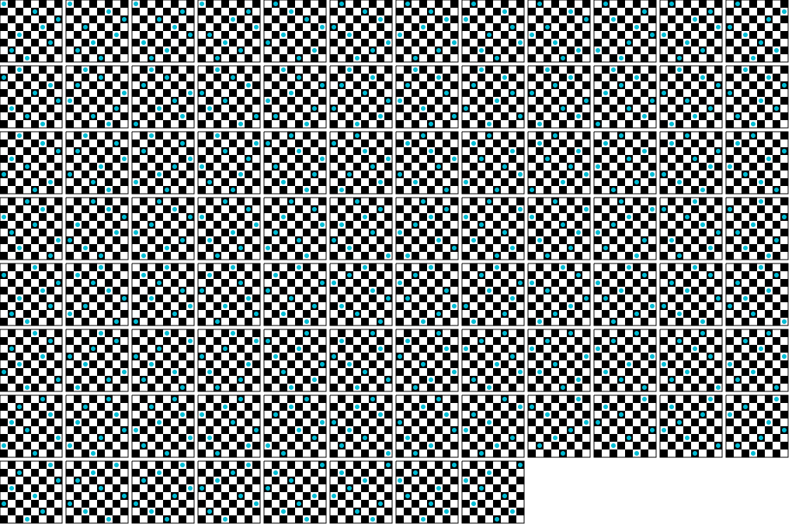

# 算法设计范式用例

该项目展示了常见的算法设计用例

## 回溯

### 用例列表

* 八皇后疑惑

``` bash
npm run n-queens
```



* 迷宫的生成和寻路算法

``` bash
npm run maze-bt-generator
```


## 引用

[bastion](https://github.com/albertngo1/bastion)，一个非常棒用于学习迷宫算法的可视化项目，包含多种迷宫`生成`算法和`解决器`。

[javascript-algorithms](https://github.com/trekhleb/javascript-algorithms)，该项目提供了常见的数据结构（树、图、队列、栈，哈希表等等），并提供了相对于的操作算法（添加、查找、删除、更新）。

[H.urna](https://hurna.io/index.html)，提供
